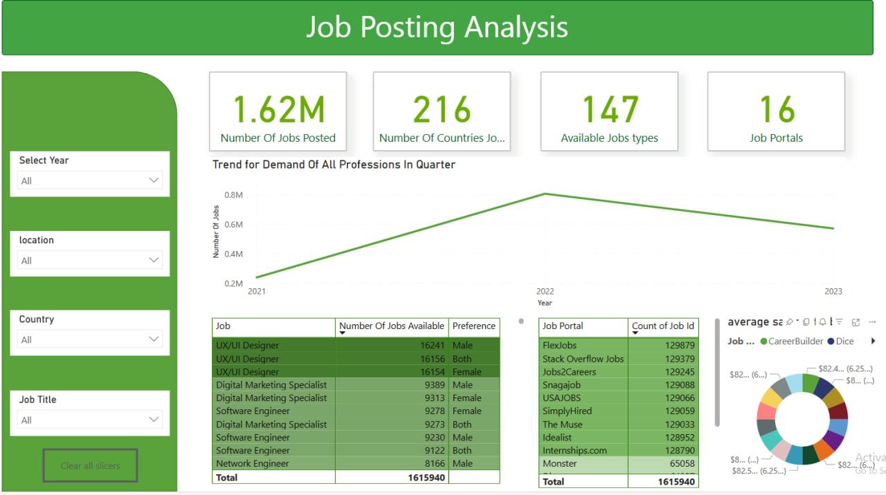

# Job Postings Analysis in years(2021,2022,2023)
#### Dataset Came from Multiple Job Posting Sites 

dataset is available on Kaggle

**Data** is pretty clean for this resaon it did not take me long time to visaulize it. 
- **Visual Data Includes:**
    - **Total** Number Of Jobs Posted 
    - Job Posted Countries 
    - Available Job Types 
    - infomation about which year Job Postings is the most 
    - what is the hihest demaned Jobs and preferance by gender 
    - how many jobs posted on each job portals
    - distribution of job counts by each job portals 

And My Visual Includes slicers where we can slice data by year, location, Country and Job Title. It Have been A good Learning project with some pretty designs
